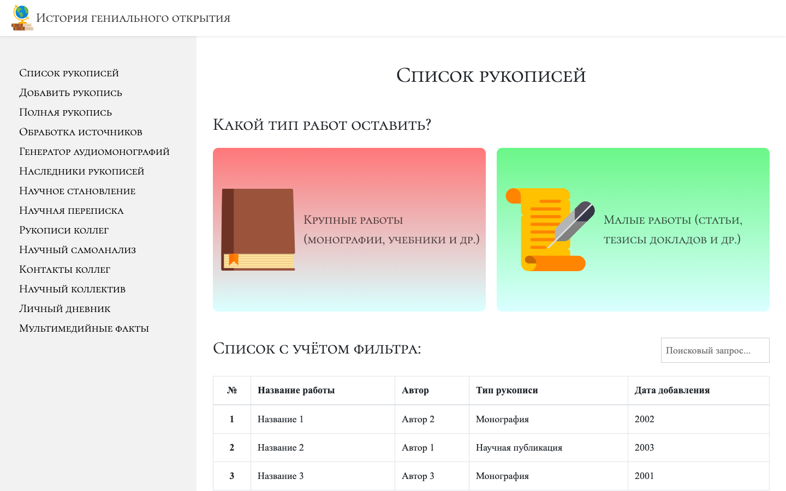

# About the SPA
**«History of Genius Discovery»** (shortly _«History GD»_ or _«GitHub for Scientists»_) is the scientific portal that was created to help 
scientists to keep own manuscripts (e.g., scientific articles, 
university manuals, and monographs).

# The Test Access for Guests

<b>Email</b>: M.V.Lomonosov@history-gd.ru

<b>Password</b>: 123456

# The Prerequisites of Creation
The software is based on following scientific article
containing main software targets and the conception:

**Mosolov R.V. Programma "Istorija genial'nogo otkrytija" //
Elektronnyye biblioteki. 2020. V. 23. No 6. https://doi.org/10.26907/1562-5419-2020-23-6-1239-1278.**

# The Current GUI
At current time, GUI looks so as shown below. This GUI presents 
part of project's worked functionality on 04.05.2020 on the left. 

# The List of Planned SPA Functionality
1) creating manuscripts;
2) keeping manuscripts as reserve copies in Internet;
3) generating manuscripts to PDF to print them;
4) accumulating big data about manuscripts to search regularities 
of scientific discoveries;
5) scientific self-analysis;
6) et al.

# The List of Planned Technological Stack
## Frontend
| # | Technology                | Role                                          |
| - |:-------------------------:|:---------------------------------------------:|
| 1 | HTML                      | Adds layout                                   |
| 2 | CSS                       | Adds stylization                              |
| 3 | JavaScript                | Frontend PL                                   |
| 4 | TypeScript                | Adds strong types to variables                |
| 5 | Next.js                   | Makes the SPA more familiarity with SEO       |
| 6 | React.js                  | Main high-level library for JS                |
| 7 | Material UI               | Adds templates of frontend components         |
| 8 | React Router              | Adds URL paths between pages                  |
| 9 | Redux                     | Manages all SPA states centrally              |
| 10 | Redux Thunk/Redux Saga   | Deletes sides effects                         |
| 11 | GraphQL/Apollo           | Sets strong types for data exchanging with DB |
| 12 | ESLint + Prettier        | Check and fix code styles into modules        |
| 13 | Grunt/Gulp               | Automates manual operations                   |
| 14 | Jest                     | Tests modules code quality                    |

The additional technological stack: Reselect.

## Backend
| # | Technology      | Role                                            |
| - |:---------------:|:-----------------------------------------------:|
| 1 | Node.js         | Server PL                                       |
| 2 | Express.js      | Main high-level library for Node.js             |
| 3 | Google Firebase | NoSQL DBMS and hosting for SPA                  |
| 4 | JWT             | Creates tokens to authenticate an user session  |
| 5 | Jest            | Tests modules code quality                      |

# The Instructions
## How to Run the SPA (for guests)
Run following terminal commands from root directory:
1. `npm install`
2. `npm run build && npm start`

Then open a browser at: http://localhost:3000/

## How to Run the SPA (for workers)
`clear && npm run build && npm start`

## How to Check Syntax Quality into Modules (using Prettier)
`clear && cd src && npx prettier --write .`

# The Project Technical Task and Timekeeping in Russian
More information about project's technical details, planned 
functionality, and planned pages of the SPA: 

https://drive.google.com/open?id=1KYWEs8QmNs79tw7Br3JS5j9R07W0w6GC

Also you can to learn statistic of work time that was oriented to 
this project: 

https://drive.google.com/open?id=1CIHTwmnrYNzT6RYXHrQ99lInUuDib980M8JNQ23s6y4
